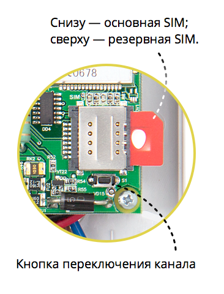
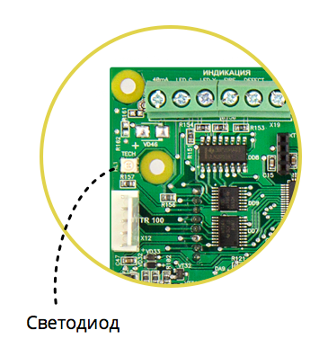

## Настройка GSM-канала

Прибор оснащён встроенным GSM-модемом, который может работать поочерёдно с одной из двух установленных SIM-карт.

### Установка SIM-карт

Держатель для SIM-карт раположен в правой части платы прибора.

Снизу (ближе к плате) находится основная SIM-карта (SIM1), сверху – резервная (SIM2). SIM-карты устанавливаются в держатель контактной площадкой в сторону платы.

Перед установкой SIM-карт в прибор обязательно **полностью обесточьте** его, в противном случае SIM-карта может быть выведена из строя статическим электричеством.

Перед установкой SIM-карты в прибор не забудьте отключить запрос PIN-кода. Если PIN-код не отключить: во-первых, прибор не сможет использовать данную SIM-карту; во-вторых, SIM-карта может заблокироваться после нескольких попыток активации.

Если вы используете только одну SIM-карту, обязательно устанавливайте её в слот для основной SIM-карты – ближе к плате.

### Проверка уровня GSM-сигнала

Перед началом эксплуатации прибора обязательно нужно проверить уровень сигнала в предполагаемом месте установки прибора. Это можно сделать при помощи светодиода HL1, который находится в левой части платы прибора.

После включения прибора светодиод HL1 индицирует продолжительной вспышкой одного из цветов выбранный прибором канал связи:

* желтый – канал Ethernet
* зеленый – канал GSM, SIM1
* красный – канал GSM, SIM2

Если светодиод горит зеленым или красным цветом, значит происходит попытка инициализации соответствующей SIM-карты и регистрация в сети GSM. После того, как прибор успешно завершит регистрацию в сети, с помощью светодиода HL1 отображается уровень сигнала GSM (RSSI):  

* зеленые вспышки – удовлетворительный уровень сигнала (больше 10 единиц)
* красные вспышки – плохой уровень сигнала (меньше или равен 10 единицам)

Вспышки, индицирующие уровень сигнала, продолжаются в течение 5 секунд.

При плохом уровне сигнала GSM необходимо перенести прибор у другое место, либо установить выносную GSM-антенну.

### Переключение на «следующий» канал связи

Для того, чтобы проверить работу всех каналов связи можно воспользоваться кнопкой S1, расположенной в правой части платы устройства рядом с держателем SIM-карт. После нажатия на кнопку S1 прибор принудительно переключится на следующий доступный канал связи.

Нажатие на кнопку S1 подтверждается индикацией: светодиод HL1 последовательно загорается красным, желтым и зеленым цветом, после чего выключается.

Последовательность переключения каналов: Ethernet ⟶ GSM SIM1 (основная) ⟶ GSM SIM2 (резервная) ⟶ Ethernet...

### Подключение выносной GSM-антенны

Для того, чтобы подключить выносную антенну вместо внутренней, нужно выполнить следующую последовательность действий:

* вынуть плату прибора из корпуса, открутив крепежные саморезы
* заменить внутреннюю антенну на выносную
* проверить, что плата с установленной выносной антенной плотно прилегает к стойкам крепления *(иногда радиус сгиба фидера в месте подключения антенны мешает установке платы в штатное положение)*
* при необходимости просверлить в корпусе отверстие диаметром 10 мм, чтобы вывести фидер антенны наружу. В этом случае необходимо сначала пропустить фидер антенны через отверстие в корпусе и только потом прикрутить его к разъему на плате.
* установить плату в корпус, прикрутив крепежные саморезы

Перед окончательным креплением внешней антенны на постоянное место установки необходимо обязательно проверить уровень сигнала на всех SIM-картах в данном конкретном месте. Если уровень сигнала неудовлетворительный, необходимо переместить антенну в другое место.

Рекомендации по установке внешней антенны:

* отнести от прибора на расстояние не менее 50 см
* не бухтовать антенный кабель
* крепить антенну на диэлектрическую поверхность
* крепить антенну в вертикальном положении