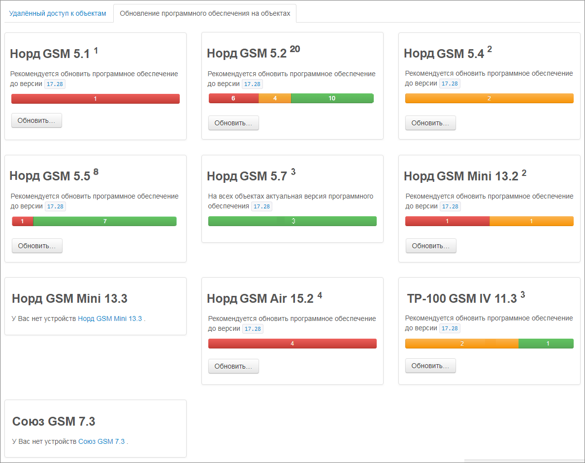
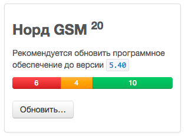
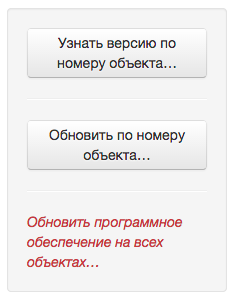
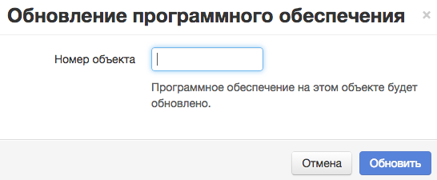
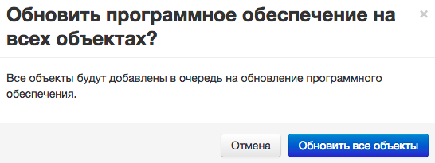

## Удалённое обновление ПО на устройстве

**Важно:** удалённое обновление ПО работает только на устройствах, которые сконфигурированы для использования IP-каналов связи: Ethernet или GPRS.

### Информация об объектах на пульте

Для удалённого обновления «прошивок» в приборах предназначена вкладка «Обновление программного обеспечения на объектах» в панели инженера:

В данной владке отображается статистика по версиям программного обеспечения, сгруппированная по типам приборов. Например, для прибора «Норд GSM»:

* 20 устройств «Норд GSM» работают на данный пульт
* Актуальная версия ПО для «Норд GSM» – 5.40
* 10 приборов в данный момент работают на старой версии, из них:
  * 6 – обозначены красным – не планируется обновлять
  * 4 – обозначены жёлтым – находятся в процессе обновления
* 10 приборов работают на актуальной версии ПО для данного оборудования

Чтобы открыть страницу обновления ПО на устройствах данного типа, необходимо нажать на кнопку «Обновить...»

### Процесс удалёного обновления ПО на устройстве

Процесс обновления «Прошивки» на устройстве состоит из нескольких этапов и спроектирован таким образом, чтобы работать даже в сетях с очень неустойчивым GPRS-сигналом.

**Постановка в очередь на обновление**

Из панели инженера «Облаку» подаётся команда для постановки устройства в очередь на обновление.

Если устройство находится на связи с «Облаком», то на устройство будет отправлена команда для повторного подключения и инициации процесса обновления.

Если устройство не находится на связи с «Облаком», то процесс обновления не начнётся до тех пор, пока устройтво не выйдет на связь.

**Загрузка актуальной «прошивки»**

Как только устройство получило команду на обновление, оно начинает загрузку архива с актуальной версией программного обеспечения. Полный объем файла составляет от 200 до 500 Килобайт в зависимости от типа устройства. Загрузка «прошивки» происходит по частям, чтобы сократить влияние обрывов связи.

Длительность этапа загрузки сильно зависит от качества связи и может составлять от нескольких минут на канале Ethernet до нескольких часов на канале GPRS.

**Проверка архива**

После полной загруки файла «прошивки» прибор проверяет его целостность и пригность к использованию на данном типе прибора и на данной аппаратной версии платы. Если все контрольные суммы совпадают и все проверки совместимости пройдены, «прошивка» помечается, как «готова к установке».

**Обновление**

Далее прибор ожидает состояния, когда хотя бы один из разделов будет снят с охраны, и перезагружается для применения обновления.

Длительность этапа обновления составляет не более 10 секунд.

**Включение**

После обновления «прошивки» идет обычное включение прибора. Все настройки и состояние охраны для разделов сохраняются в том же состоянии, как были до обновления.

### Обновление ПО на выбранном объекте

Если есть необходимость проверить функции новой версии программного обеспечения на одном или нескольких объектах перед массовой установкой, можно воспользоваться обновлением ПО на выбранном объекте.

Для этого на странице обновления ПО нужно нажать на кнопку «Обновить по номеру объекта...»:

В появившемся диалоге ввести номер объекта для обновления:

И нажать кнопку «Обновить». После этого данный объект будет добавлен в очередь на обновление ПО.

### Обновление ПО на всех объектах

После проверки ПО на нескольких объекта, можно добавить в очередь на обновление все оставшиеся с предыдущей версией ПО объекты.

Для этого на странице обновления ПО нужно нажать на кнопку «Обновить программное обеспечение на всех объектах...»

В появившемся диалоге:

нажать кнопку «Обновить все объекты». После этого все объекты данного типа с неактуальной версией ПО будут добавлены в очередь на обновление.

### Остановка процесса обновления

Если по какой-то причине появилась необходимость остановить процесс обновления, то его можно прервать до тех пор, пока прибор целиком не загрузил файл обновления.

Для этого необходимо нажать «Отменить обновление...» и подтвердить действие.

