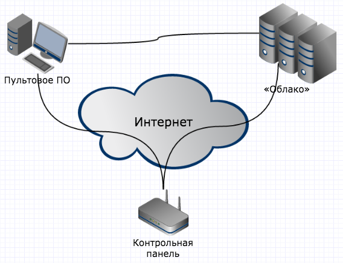

# Удалённый доступ к прибору

## Описание технологии удалённого доступа

Удалённый доступ к прибору включает в себя следующие функции:

* Удалённое обновление программного обеспечения на объекте
* Удалённое конфигурирование объекта
* Удалённое взятие и снятие объекта с охраны пользователем
* Удалённое взятие и снятие объекта с охраны оператором пульта
* Управление состоянием дебиторской задолженности

Для работы всех перечисленных функций необходимо совместимое пультовое программное обеспечение, например, «Центр охраны». Дополнительно, для работы функций удалённого обновления «прошивок», конфигурирования и взятия/снятия пользователем, необходимо подключение прибора к «Облаку» (публичному Облаку Си-Норда – `cloud.cnord.net` – или частному Облаку охранной организации).

Схема подключения выглядит следующим образом:

Прибор подключается и к пультовому ПО, и к «Облаку» по протоколу CML с использованием потокового шифрования *(Протокол CML – C.Nord Markup Language – разработка компании Си-Норд)*. Пультовое ПО также подключается к «Облаку» по зашифрованному протоколу.

### Канал связи прибор ⟷ пульт

Данный канал связи используется для работы охранных функций прибора, таких как:

* Передача событий (тревоги/постановки/снятия/неисправности) на пультовое ПО
* Удалённое взятие и снятие объекта с охраны оператором пульта
* Управление состоянием дебиторской задолженности

В общем случае прибор соединяется с пультом через публичную сеть (Интернет). Однако, некоторые охранные предприятия используют для связи `прибор ⟷ пульт` выделенные внутренние подсети операторов GSM-связи или локальные сети Ethernet.

Для передачи событий на пульт могут использоваться разнообразные каналы связи: Ethernet, GPRS, CSD, Voice, SMS.

**Важно:** удалённое взятие/снятие и управление дебиторской задолженностью работают только при подключении прибора по IP-каналу связи: Ethernet или GPRS.

### Канал связи прибор ⟷ «Облако»

Данный канал связи используется для работы сервисных функций прибора, таких как:

* Удалённое обновление программного обеспечения на объекте
* Удалённое конфигурирование объекта
* Удалённое взятие и снятие объекта с охраны пользователем

В случае использования публичного «Облака» прибор соединяется с «Облаком» через сеть Интернет. Если же используется «Частное облако», возможна организации подключения через выделенные внутренние подсети операторов GSM-связи или локальные сети Ethernet.

Для работы всех сервисных функций прибор должен находится на IP-связи с «Облаком» по Ethernet или GPRS.

**Важно:** возможные перерывы в связи `прибор ⟷ «Облако»` никак не влияют на охранные функции прибора.

### Канал связи пульт ⟷ «Облако»

Данный канал связи используется для обеспечения работы сервисных функций прибора.

**Пультовое ПО передает в «Облако»:**

* информацию об инженерах и их разрешениях  
  *для работы панели инженера*
  
* информацию об администраторах личного кабинета и их объектах  
  *для работы личного кабинета `my.cnord.net` и мобильного приложения `MyAlarm`*
  
* события по объектам  
  *для работы личного кабинета и мобильного приложения*
  
**«Облако» передает в Пультовое ПО:**

* события о попытках подключения инженера к объекту  
  *для работы панели инженера*
  
* события о попытках взятия/снятия из мобильного приложения `MyAlarm`
  *для работы мобильного приложения*
  
* события о проверке тревожной кнопки при помощи `Call-центра`  
  *для работы автоматизированной проверки тревожной кнопки*
  
В случае использования публичного «Облака» пультовое ПО соединяется с «Облаком» через сеть Интернет. Если же используется «Частное облако», возможна организации подключения через локальные сети Ethernet.

**Важно:** возможные перерывы в связи `пульт ⟷ «Облако»` никак не влияют на охранные функции прибора.