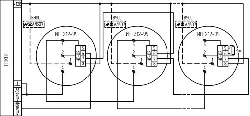

## Проводные шлейфы

### Подключение пожарных датчиков

#### 4-проводные пожарные датчики

4-проводные пожарные датчики подключаются аналогично обычным охранным извещателям. Два провода – на клеммы нужной зоны: один – на клемму Z1..Z8, второй – на клемму GND соответствующей группы зон. Оставшиеся два провода (питание датчика) – к клеммам GND и PWR.

Если необходимо осуществлять сброс питания пожарных датчиков после тревоги, то «плюсовой» провод питания датчика нужно подключить к клемме SMOKE на приборе. В таком случае после завершения интервала повтора тревог (см. раздел «Конфигурирование») питание с датчиков будет кратковременно отключаться.

#### 2-проводные пожарные датчики

2-проводные пожарные датчики подключатся к прибору только через устройство согласования, которое позволяет подключать 2-проводные датчики по 4-проводной схеме. В качестве такого устройства может выступать, к примеру, УС-02, производимое компанией Рубеж.

Пример подключения пожарных датчиков с использованием УС-02:

